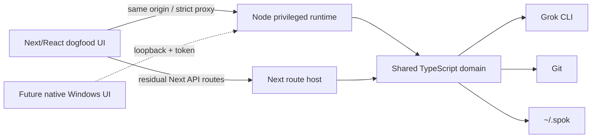

# Spok Runtime And Native Desktop Architecture

Last updated: 2026-07-11

Status: the shared Node runtime and supervised contributor dogfood path are operational. The end-user native Windows UI has not started.

This document defines the current runtime boundary and the migration from the React/Tauri dogfood application to a native Windows product. Product priority and sequencing live in `docs/HARNESS_AUDIT_AND_ROADMAP.md`; security controls live in `docs/SECURITY_POSTURE.md`.

## Binding Decisions

| Area | Decision |
| --- | --- |
| Product platform | Windows first; macOS/Linux later. |
| End-user UI | Native Windows UI, provisionally WinUI 3/C#. No permanent browser, WebView, Electron, or Tauri product shell. |
| Privileged runtime | TypeScript on Node 20. Do not rewrite spawn, Git, policy, sessions, stream, or automation domain logic in native code. |
| Client/runtime transport | Loopback HTTP with an in-memory capability token and versioned JSON/NDJSON contracts. |
| Current contributor UI | Existing Next/React application. Tauri remains an interim internal shell only. |
| Pending approvals on runtime restart | Drop them, reconcile affected runs, and show an explicit interruption state. |
| Diff product quality | Monaco in the current UI; a high-quality accessible native diff is required before native cutover. |
| Network use | Normal Grok, Git remote, connector, MCP, update, and webhook traffic remains supported. “Native” does not mean offline-only. |

## As-Built Architecture

The current UI is feature-complete and remains the design reference while runtime contracts stabilize. `npm run dev:app` dogfoods the standalone runtime behind that UI; `npm run dev` continues to use Next-hosted adapters directly.

### Runtime-owned routes

The standalone router currently owns:

- health and token bootstrap;
- session start/stop stream;
- session list/read/delete/events;
- Git status/actions and Git diff;
- filesystem browse;
- workspace trust;
- settings and approvals;
- durable automation job ledger and restart reconciliation;
- diagnostics and Grok CLI status.

These handlers live under `src/server` with thin `src/app/api` adapters.

### Residual Next-hosted routes

Automation schedules/channels, extensions/hooks, attachments, secrets, and live-runtime discovery still depend on Next route hosting. The job ledger already runs through the standalone runtime. Residual routes use the same capability token during `dev:app`, but they are not yet standalone-runtime contracts. Extract them before a native client depends on them.

## Contributor And Dogfood Commands

| Command | Purpose |
| --- | --- |
| `npm run dev:app` | Preferred standalone-runtime dogfood: supervise runtime, wait for health, start Next UI, proxy extracted routes, and tear down both trees. |
| `node scripts/dev-app.mjs --check` | End-to-end launcher readiness and clean-shutdown check. |
| `npm run runtime` | Privileged runtime only, default loopback port 7788 or `SPOK_PORT`; `0` requests an OS-assigned port for supervisors. |
| `npm run dev` | Direct Next contributor path; useful while residual routes remain. |
| `npm run desktop` | Interim Tauri/WebView dogfood; not the product target. |

The launcher generates one random capability token, passes it to its child processes through inherited environment, and never prints it, adds it to a URL, or writes it to a launcher-owned file. The runtime announces its OS-held port over parent/child IPC. Next proxies only the extracted route allowlist to an exact `http://127.0.0.1:<port>` origin.

## Security Boundary

Spok is a privileged local harness. A native client does not weaken the boundary.

Required on every privileged runtime path:

- bind loopback only;
- validate Host and, for browser dogfood, Origin;
- require the capability token after bootstrap;
- canonicalize and contain workspace paths;
- require durable workspace trust;
- evaluate command/Git/automation policy and explicit approvals;
- redact secrets before UI, logs, exports, and diagnostics;
- record audit events for spawn, Git, browse, trust, approvals, denials, hooks, MCP, and future extension actions;
- cap file/diff/log payloads and deny secret/binary previews where applicable;
- avoid shell execution for normal child processes.

The native host must call the same APIs. It must not gain a general “execute arbitrary argv” bridge.

## Runtime Supervisor Contract

The current JavaScript dogfood launcher is a precursor, not the final Windows supervisor. A production native host must:

1. Select an OS-held loopback port and spawn a fixed, bundled runtime entry point with fixed arguments.
2. Generate a random token and keep it in process memory only.
3. Wait for a structured ready signal, then verify `/api/health`, runtime PID, version, and API capabilities.
4. Restart with bounded backoff after unexpected failure and surface interrupted sessions/approvals.
5. Stop registered Grok child process trees before runtime shutdown.
6. Use a Windows Job Object or equivalent kill-on-close ownership so runtime and agent processes cannot orphan.
7. Record non-secret supervisor diagnostics: version, PID, port, timestamps, exit reason, restart count, and token hash only if a diagnostic identity is necessary.
8. Refuse incompatible client/runtime API versions with a clear update path.

## Durable Contract

The runtime, React client, and future native client share these durable identities:

- workspace/trusted root;
- automation job;
- session;
- process run and prompt turn;
- worktree and branch;
- approval request/decision;
- normalized event and raw provider event;
- validation run/artifact;
- Git handoff and terminal outcome.

Session formats remain versioned under `~/.spok/sessions`. Runtime API changes must not require a native client to understand the private filesystem layout. Import/export/replay schemas must preserve unknown provider events.

Before native UI implementation expands, add a capability response containing:

- runtime semantic/API version;
- supported route groups and schema versions;
- stream/event contract version;
- provider adapter availability;
- platform capabilities;
- feature flags required for graceful client fallback.

## Migration Sequence

### A1 — Finish the standalone runtime

1. Extract automation schedules/channels and notification APIs; the durable job ledger is already standalone-runtime owned.
2. Extract extensions, hooks, skills/MCP discovery, attachments, secrets, and live-runtime APIs.
3. Add handler parity tests and a versioned capability response for every route group.
4. Move queue pumping and schedule reconciliation into the supervised runtime.

Exit: `npm run dev:app` can exercise the entire product without a privileged Next route implementation.

### A2 — Make the runtime portable and recoverable

1. Bundle the runtime and its Node dependency without relying on a source checkout.
2. Add run/process metadata and restart reconciliation for stale sessions/jobs.
3. Add Windows Job Object supervision in a minimal native host spike.
4. Add upgrade/rollback compatibility tests for runtime and durable schemas.

Exit: a minimal host can start, health-check, stop, restart, and upgrade the runtime without orphaning agent processes or losing terminal state.

### N0 — Native shell proof

Build a small WinUI host that supervises the packaged runtime and implements repository selection/trust, session inbox, settings bootstrap, keyboard navigation, theming, accessibility, and diagnostics.

This is a quality/architecture proof, not a second feature roadmap. Stop if startup, memory, accessibility, or developer velocity do not justify the native track.

### N1 — Core agent loop

Implement new task launch, policy mode, NDJSON stream, stop, approvals, thinking/events, session restore, and worktree identity. Use virtualized native controls from the start.

### N2 — Review and validation

Implement high-quality unified/split diff, risk/issue markers, causal navigation, validation results/artifacts, inline comments, Git staging/commit/push/PR, and review-ready handoff.

### N3 — Mission control and extensibility

Implement multi-session fleet controls, schedules/notifications, mobile handoff, skills/hooks/MCP management, and remaining settings only after the core loop meets parity.

### N4 — Product cutover

Package, sign, update, migrate, and soak the native product. Keep the React UI available to contributors until the native must-have matrix is green; then demote Tauri and browser product documentation.

## Native Cutover Gates

| Capability | Required |
| --- | --- |
| Repository open/trust and policy selection | Yes |
| Multiple isolated sessions and durable recovery | Yes |
| Live stream, stop, approval, and error handling | Yes |
| Virtualized thinking/event views | Yes |
| High-quality unified/split diff with issue/causal navigation | Yes |
| Validation evidence and artifacts | Yes |
| Composer, attachments, slash commands, and usage state | Yes |
| Git stage/commit/push/PR and safe worktree cleanup | Yes |
| Settings, diagnostics, redaction, and audit | Yes |
| Keyboard core loop, AA contrast, reduced motion, screen-reader labels | Yes |
| No WebView/browser in end-user shell | Yes |

## Performance Budgets

Measure on a representative release-build Windows laptop.

| Measure | Target | Hard regression ceiling |
| --- | ---: | ---: |
| Native cold launch to usable inbox | 1.2 s | 2.5 s |
| Warm launch | 500 ms | 1.0 s |
| Idle RSS, native UI + runtime | 150 MB | 280 MB |
| Recent session first useful content | 300 ms | 500 ms |
| Stream reducer work per burst | 8 ms | 16 ms |
| Common diff open/tab switch | 150 ms | 300 ms |
| 10k-event navigation | No visible dropped interaction frames | No multi-second stall |

Current React budgets remain enforced by `tests/perf` until native cutover.

## Verification Gates

For runtime work:

- focused handler/security/process tests;
- `npm run test:server`;
- `node scripts/dev-app.mjs --check` when launcher/proxy behavior changes;
- `npm test` and `npm run build` before integration;
- explicit tests for token/origin/host denial, untrusted paths, policy denial, cancellation, child-tree cleanup, and restart recovery.

For native work:

- runtime contract tests shared with the React client;
- automated accessibility and keyboard traversal;
- performance traces from release builds;
- visual review on standard/high-contrast themes and 100–200% scaling;
- crash/restart/orphan-process tests;
- signed-package upgrade and rollback rehearsal before external release.

## Explicit Non-Goals

- Rewriting the privileged runtime in C#, C++, Rust, or Qt.
- Making Tauri/WebView the permanent product shell.
- Introducing Hono, Vite, or another framework solely to satisfy an obsolete intermediate plan.
- Starting two independent product designs before shared lifecycle/API contracts stabilize.
- Sacrificing trace, diff, validation, accessibility, or review quality to claim a native shell is “done.”
