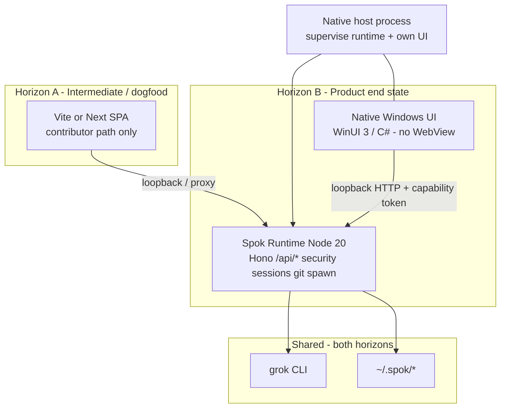
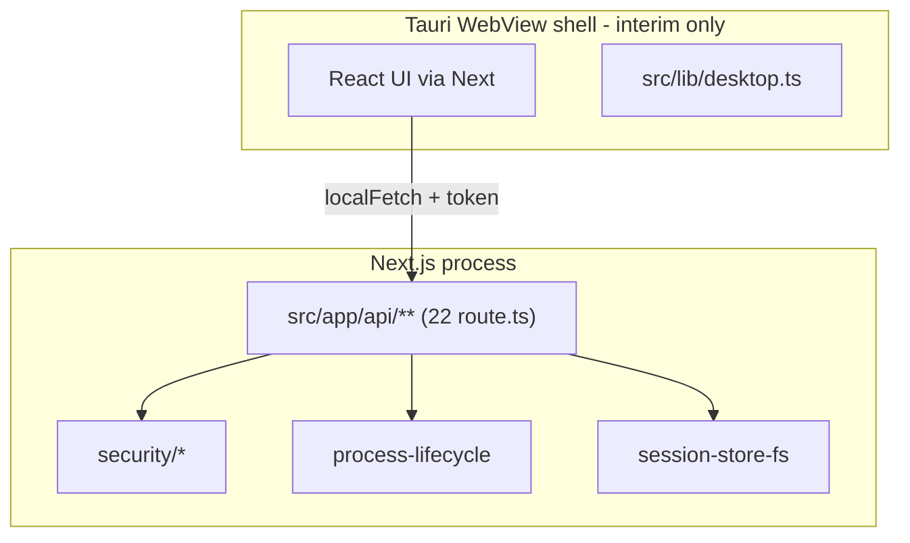
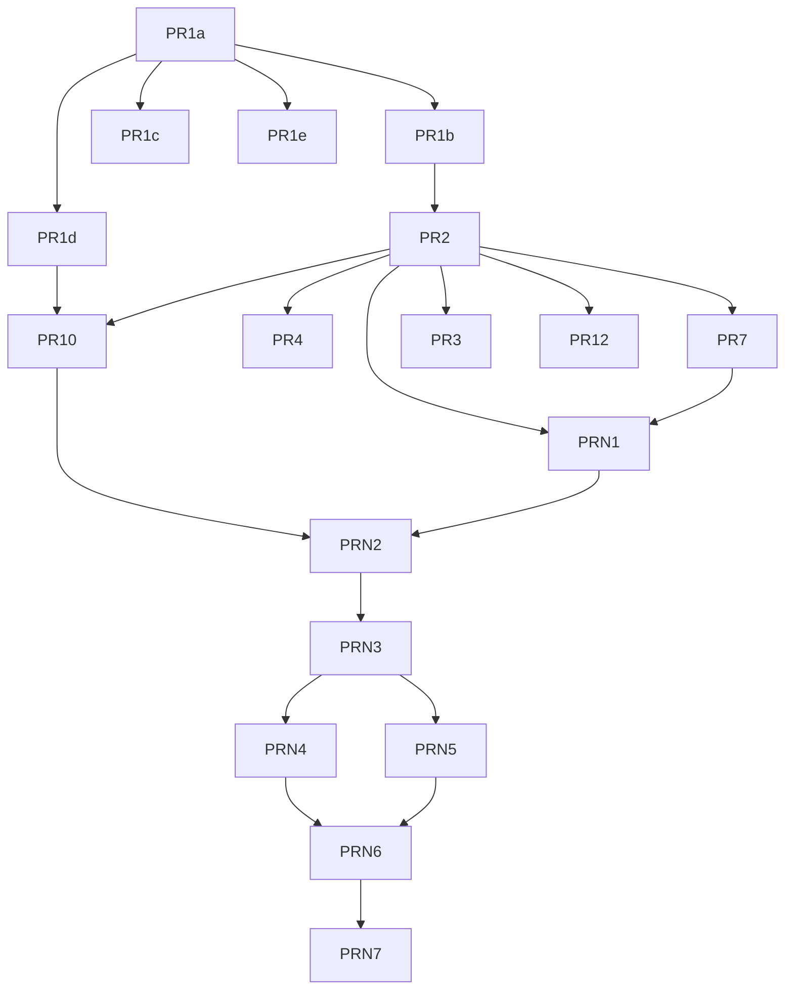

# High-Efficiency, Low-Overhead Spok Desktop Architecture

| Field | Value |
|---|---|
| **Title** | High-efficiency, low-overhead Spok desktop architecture |
| **Author** | _(TBD)_ |
| **Date** | 2026-07-10 |
| **Status** | **Approved — Track A Stage 1 started (PR1a done)** |
| **Repo** | `C:\dev\spok` |
| **Related** | `docs/HARNESS_AUDIT_AND_ROADMAP.md`, `docs/UPDATER_AND_DESKTOP.md`, `docs/SECURITY_POSTURE.md` |
| **Revision** | R6 - aligned with current competitive roadmap and docs cleanup |

---

## Overview

Spok is a **privileged local harness** for Grok Build: spawn the CLI, stream thinking traces, visualize repo diffs, persist sessions, enforce permissions, and manage git/automation. Today that product is delivered as **Next.js 15 App Router + React 19 + Zustand + Monaco**, with a **thin Tauri 2 shell** that embeds a WebView and provides OS glue (folder picker, notifications, open/reveal, `get_app_info`, deep-link emit). The expensive privileged work already lives in **Node route handlers** under `src/app/api/**` — not in Rust or the WebView.

### Product direction (user decisions)

| Decision | Choice |
|---|---|
| Shell packaging platforms | **Windows-only first** (macOS/Linux later) |
| Long-term UI surface | **Native desktop UI, not a web-based app** — no permanent browser/WebView/SPA/Tauri-as-product UI. **Network / internet use continues** (Grok CLI → xAI, git remotes, GitHub/PRs, channels/webhooks, MCP, package/update checks, etc.) |
| Privileged runtime | **Stay TypeScript (Node)** — do **not** rewrite spawn/git/policy/sessions in C |
| Pending approvals on runtime restart | **Drop** with UI banner (confirmed) |
| Diff quality | Intermediate SPA: Monaco default + optional efficiency mode. **Native end state:** high-quality native (or native-hosted) diff visualization — not full browser stack |

This document therefore uses a **dual-horizon** architecture:

1. **Horizon A — Intermediate (ship value now):** Extract a standalone **Node privileged runtime**; keep a **contributor / dogfood** path (Vite SPA or existing Next) that is **not** the permanent product. Optionally a temporary thin shell may supervise the runtime only if needed for packaging experiments — it is **not** the end-state UI.
2. **Horizon B — End state (product goal):** A **native Windows desktop UI** (provisional stack: **WinUI 3 / C#**) that talks to the same privileged TypeScript runtime over **loopback HTTP** (or equivalent local IPC), with **no WebView** and **no browser as UI**.

The goal is a desktop app that **starts and responds quickly**, preserves harness **functionality and data visualization** (thinking/events, diffs, metrics, live session viz), and **does not regress** the capability-token / origin / workspace-trust / approval model in `docs/SECURITY_POSTURE.md`.

**UI vs network (wording fix, R5):** “Not web-based” means the **product surface** is a **native Windows shell** — not a permanent browser tab, SPA, WebView2 host, or Tauri-as-product UI. It does **not** mean offline-only or “no HTTP anywhere.” Spok and its agents **still interact with the network as expected today**: Grok CLI talking to xAI, git remotes, GitHub/PRs, channels/webhooks, MCP over the network, package/update checks, and loopback HTTP between native UI and the Node runtime.

---

## Dual-horizon architecture



| Horizon | UI | Who uses it | WebView / browser? |
|---|---|---|---|
| **A Intermediate** | Existing Next and/or Vite SPA | Contributors, dogfood, regression of harness APIs | Allowed as **migration tool only** |
| **B End state** | Native WinUI 3 app | **End users / product** | **Forbidden** as product surface |

**Honest scope note:** Replacing the full React harness UI with native controls is a **large** multi-month track. Horizon A is mandatory so features keep shipping while Horizon B is built. Horizon A must not be mistaken for the destination.

---

## Background & Motivation

### Current architecture (as-built)



**Privileged local APIs** (the durable backend contract for both horizons):

| Surface | Routes |
|---|---|
| Health / token | `GET /api/health` |
| Session spawn/stream | `POST/DELETE /api/session/start` |
| Git | `/api/session/git`, `/api/session/git-diff` |
| FS browse | `/api/fs/browse` |
| Trust | `/api/workspace/trust` |
| Sessions durable | `/api/sessions`, `/api/sessions/[id]`, `.../events` |
| Settings / approvals / secrets | `/api/settings`, `/api/approvals`, `/api/secrets` |
| Extensions / automation | `/api/extensions/*`, `/api/automation/*` |
| Diagnostics / CLI status | `/api/diagnostics`, `/api/runtime/cli-status` |

**Security boundary (must not regress on either horizon):**

- Capability token (`x-spok-capability-token`), local Host/Origin (SPA path) or Host + token (native client).
- Workspace trust, command profiles, permission modes, approval overlay, audit, secret redaction/vault.
- Process spawn **never** controlled by a web page. Native UI also must not pass arbitrary spawn argv — only call the same policy-gated APIs.

**Process-local state today (restart-sensitive):**

| State | On restart |
|---|---|
| Capability token | New random unless `SPOK_LOCAL_TOKEN` (lab only) |
| Trusted roots | Cleared unless durable (PR10) |
| Process registry | Handles lost; orphans possible |
| Pending approvals | Dropped (confirmed product choice + banner) |

### Pain points

| Pain | Severity |
|---|---|
| Dual-stack Tauri + Next cold start / memory | High |
| WebView/Chromium (or system WebView2) overhead for a local tool | High (motivates **native UI** end state — not a web-based product shell) |
| Rust toolchain for thin shell that is not the product UI | High for Windows contributors |
| Privileged logic stuck behind Next App Router | High for native client |
| Stream → React churn | Medium (Horizon A) |

### What we will not do

- Full rewrite of **runtime** (spawn, git, policy, sessions, stream parse) in C/C++/Qt.
- Treat “open Spok in Chrome” or a permanent Tauri/WebView shell as the **product**.
- Sacrifice harness visualization quality in the native end state (trace, diffs, metrics remain first-class).

---

## Goals & Non-Goals

### Goals

1. **Fast cold start and low overhead** for the **native** product on Windows.
2. **Snappy UI** while streaming (virtualized trace, responsive composer/status).
3. **Preserve harness functionality** per feature-parity matrix (both horizons).
4. **Preserve visualization quality** — native virtualized tree + high-quality diffs + metrics.
5. **Incremental delivery** — Horizon A runtime extraction ships first; Horizon B native UI replaces web UI without rewriting the runtime.
6. **No security regression**; improve restart safety (durable trust, orphan reaping, token re-bootstrap).
7. **Windows-only** product packaging first.
8. **Native UI product surface** (not a web-based app): no permanent browser/WebView/SPA/Tauri-as-product UI in the end state.
9. **Network / agent / web-service interaction continues** as today (Grok CLI → xAI, git remotes, GitHub/PRs, channels, MCP, updates) — Spok is **not** offline-only.

### Non-Goals

- Full C rewrite of privileged runtime domain logic.
- Permanent Electron/Tauri/WebView product shell (or marketing “open Spok in Chrome” as the product).
- **Offline-only / air-gapped-by-default product** — network use by Grok CLI, git, connectors, and related services remains expected.
- macOS/Linux product packaging in Horizon B v1 (design runtime APIs to stay portable).
- Multi-tenant remote hosting of privileged APIs.
- Headless OS schedule daemon (in-app timers only until a later product feature).
- Named-pipe auth beyond loopback + token for v1 (may revisit for native-only lock-down).

### Feature-parity matrix (product cutover = Horizon B)

| Capability | Must (native product) | Should | Later / dogfood-only |
|---|---|---|---|
| Open repo / trust / native folder picker | ✓ | | |
| Launch Grok + NDJSON stream + stop/kill | ✓ | | |
| Thinking trace virtualized + thinking stream | ✓ | | |
| Diff panel high-quality + git-diff poll | ✓ | | |
| Durable sessions restore + export/import v2 | ✓ | | |
| Capability token + policy/approvals + audit | ✓ | | |
| Settings (permission mode, grants) | ✓ | | |
| Samples / import | ✓ | | |
| Git panel stage/commit/branch basics | | ✓ | |
| Secrets vault | | ✓ | |
| Extensions / automation monitor | | ✓ | |
| Vite/Next SPA daily driver | | | ✓ contributor |
| CRT theme | | | optional polish |
| Channels, signed updater, deep-link OS reg | | | ✓ |

---

## Performance Budgets

### Baseline-first (unchanged policy)

Record **B0** (current Next+Tauri) and **B1** (minimal native host + Node runtime hello) before hard ship gates.

### Provisional targets (Horizon B native product)

| Metric | Target | Max | Notes |
|---|---|---|---|
| Shell window visible | ≤ 400 ms | ≤ 800 ms | Native WinUI frame |
| First interactive (runtime health OK + welcome) | ≤ 1.2 s | ≤ 2.5 s | Includes runtime spawn |
| Idle RSS (UI + runtime, no heavy editor) | ≤ 150 MB | ≤ 280 MB | No WebView/Chromium |
| Peak live stream 30 min | ≤ 400 MB | ≤ 600 MB | Exclude Grok child |
| Stream UI throughput | ≥ 100 normalized events/s | ≥ 50/s hard floor | Post-coalesce `StreamEvent`s |
| Trace 20k nodes scroll | Virtualized, flatten ≤ 16 ms | 20k min | Native ListView/ItemsRepeater |
| Diff open (warm) | ≤ 200 ms | ≤ 500 ms | Native/AvalonEdit path |
| Install footprint (excl. WebView2 — not required) | ≤ 150 MB | ≤ 200 MB | Bundled Node + native UI |

### Horizon A (SPA dogfood) provisional

Retain softer WebView-era budgets from R3 only as dogfood gates: architecture floor idle RSS ≤ 280 MB without Monaco; first interactive ≤ 2.5 s. **Not** product success criteria once Horizon B ships.

**Event definition:** normalized `StreamEvent`s after ingest coalescing. Memory: sum native UI process + runtime Node; exclude Grok/git children.

---

## Proposed Design

### Layer split (both horizons)

| Layer | Language | Horizon A | Horizon B |
|---|---|---|---|
| Privileged runtime | **TypeScript / Node 20** | Required | Required (unchanged) |
| HTTP adapter | Hono on Node | Required | Required |
| Session reduce / stream parse | TypeScript shared | Used by SPA | Used by runtime + optional client-side mirror; native may reimplement thin client materializer calling same APIs |
| Product UI | — | SPA dogfood | **WinUI 3 C#** |
| Runtime supervisor | Native or `dev-app.mjs` | Launcher script | **Same native process** as UI (or sibling process with fixed argv) |

### Privileged runtime (TypeScript) — stays

Extract handlers from `src/app/api/**` into `src/server/**`.

- Bind **only** `127.0.0.1`.
- **Port policy:** dogfood prefer **7788** + fallback via `scripts/dev-app.mjs`; **native prod:** parent (native host) probes ephemeral port, injects `SPOK_PORT`, never exposes token to disk raw.
- Random capability token per process; SPA/native both use header after `/api/health` (or boot handshake).
- Diagnostics: `~/.spok/runtime/<pid>.json` + `<pid>-children.json` (token **SHA-256 only**).
- Shutdown: **process signals / Job Object only** — no unauthenticated HTTP shutdown.
- Durable trust: `~/.spok/workspace-trust.json` before multi-start dogfood.
- Pending approvals: **drop on restart + banner** (confirmed).

**Contract stability:** `/api/*` paths, NDJSON session stream, stream schema v1, session disk layout v1 — so native UI is a new client, not a new backend.

### Horizon A — Intermediate SPA / contributor path (not product)

- Vite React SPA **or** keep Next until extraction complete; purpose: dogfood runtime, tests, contributor velocity.
- `scripts/dev-app.mjs`: port → runtime → Vite proxy (`VITE_API_PROXY_TARGET`).
- Monaco: **default quality** (`ui.perfMode: balanced`); optional **efficiency** mode / >5k line lightweight path.
- Pure `reduceSession` shared by `store.ts` and `session-replay.ts`; rAF batching; tight selectors.
- **No requirement** to ship Tauri/WebView to end users in Horizon A; browser dogfood is enough for API parity.

### Horizon B — Native Windows UI (product end state)

#### Provisional stack recommendation: **WinUI 3 + C# (.NET 8)**

| Option | Verdict | Notes |
|---|---|---|
| **WinUI 3 + C#** | **Recommended provisional** | Windows-first; modern packaging (MSIX); strong ListView/ItemsRepeater virtualization; FileOpenPicker; native notifications; no WebView required; good IDE support |
| WPF + C# | Acceptable fallback | More mature third-party editors (AvalonEdit); slightly older UI stack; fine if WinUI packaging friction blocks |
| Qt (C++/QML) | Possible later | Strong widgets; heavier C++ cost; not needed for Windows-only first |
| egui / iced (Rust) | Not preferred | Immediate-mode friction for large tree+diff IDE layouts |
| Full C + raw Win32 | Rejected for UI | Functionality velocity too low |

**Rationale:** Functionality-first on **Windows-only**. C# WinUI keeps UI productivity high while the **Node TS runtime** remains the privilege boundary. Avoids Chromium/WebView entirely. Cross-platform later can reconsider Avalonia or Qt without rewriting the runtime.

#### Native process model

```
Spok.exe (WinUI 3)
  ├─ owns window, native controls
  ├─ spawns/supervises Node runtime (bundled) with fixed argv + SPOK_PORT
  └─ HttpClient → http://127.0.0.1:PORT/api/* + capability token
```

Supervisor contract mirrors R3 shell contract: fixed allowlisted runtime path; no arbitrary argv from “page”; restart backoff; Job Object kill-on-close; orphan reap via per-pid children files.

#### Native client ↔ runtime auth

| Concern | Approach |
|---|---|
| Token | `GET /api/health` after connect; store in memory only; refresh on 401/`invalid_token` and after runtime restart |
| Origin | Native `HttpClient` often sends **no Origin** — already allowed when Host is local (tooling residual). Prefer always setting Host correctly on loopback |
| Optional harden (later) | Unix-domain socket / named pipe with ACL; out of scope for first native ship if loopback+token sufficient |

#### Native visualization (native UI — not web-based product surface)

| Surface | Approach |
|---|---|
| Trace tree | Virtualizing `ItemsRepeater` / `ListView` over flattened visible nodes; expand/collapse state in C# VM |
| Thinking stream | Virtualized text blocks; apply server/client stream coalescing equivalent to `trace-text` / `grok-stream` rules (port algorithms to C# or keep a small shared JSON contract of pre-coalesced events from runtime) |
| Diff quality | **Default high quality:** AvalonEdit (WPF interop or community ports) **or** WinUI custom two-pane with syntax coloring via TextMate grammars / ColorCode-class libraries; hunk navigation; binary/secret gates unchanged via API |
| Efficiency mode | Plain text hunk list for huge files (>5k lines) — same product idea as SPA `ui.perfMode` |
| Metrics / status | Native bars bound to metrics DTOs from API/session snapshot |
| Composer | Native multiline + slash-command list from API/static catalog |

**Do not** embed Monaco via WebView “just for diffs” — that reintroduces web surface. If a richer editor is needed, use **native-capable** components only.

#### Stream materialization in native UI

Options (pick during native track spike):

1. **Preferred:** Runtime continues to emit NDJSON; native client ports a thin `GrokStreamIngestor` + pure reduce **in C#** (or calls a small pure-TS helper only if we ship a separate non-UI node worker — avoid). Mirror tests with golden fixtures from `tests/fixtures/grok/*`.
2. **Alternative:** Runtime materializes session snapshots over WebSocket/SSE of `StreamEvent`s already normalized — UI only applies pure reduce. Larger server change; better single source of truth.

Session replay/import can reuse disk events via runtime APIs (`/api/sessions/...`) so native UI does not reimplement FS layout.

### Dev launcher (Horizon A) — still required

`scripts/dev-app.mjs` remains the dogfood entry: prefer port 7788, spawn runtime, health wait, Vite proxy. See R3 contract (unchanged intent).

### Runtime lifecycle & failure modes

| Failure | Behavior |
|---|---|
| Runtime exit | Signal handlers kill process registry; Job Object; per-pid children reap |
| Pending approvals | **Dropped** + banner (confirmed) |
| Token after restart | Client force health; never query/hash token |
| Durable trust / grants / sessions | Survive on disk |
| Native UI | Banner + reconnect; re-spawn runtime per supervisor policy |
| Browser dogfood | “Restart `dev:app`” if proxy/runtime dead; no shell IPC |

### Dual-run / CORS (Horizon A only)

- No Next → standalone cross-origin.
- Vite proxy or same-origin only.
- No privileged `Access-Control-Allow-Origin: *`.
- Origin matrix dogfood test: `Origin: http://127.0.0.1:5173` + `Host: 127.0.0.1:7788`.

Native clients do not use CORS.

### Streaming NDJSON contract

Unchanged: `application/x-ndjson`, cancel → `stopSessionProcess`, integration test start→N lines→stop→process gone. Hono maps abort to socket close.

---

## API / Interface Changes

### Preserve

All privileged routes, capability header, stream schema v1, session logs, approval/grant semantics.

### Add

| Item | Purpose |
|---|---|
| `src/server/**` + Hono | Shared handlers |
| `GET /api/health` fields | `runtime`, `pid`, `version` |
| `scripts/dev-app.mjs` | Horizon A dogfood |
| Native host env | `SPOK_PORT`, `SPOK_HOME`; optional lab `SPOK_LOCAL_TOKEN` |
| Optional later | Compact event batch endpoint for native high-rate ingest |

### Deprecate / remove (over time)

| Item | When |
|---|---|
| Next as required host | After runtime + dogfood SPA stable |
| Tauri / WebView product packaging | After Horizon B native UI reaches feature-parity **must** column |
| “Open in browser” as marketed product | Horizon B GA |

---

## Data Model Changes

| Store | Change |
|---|---|
| Session logs | Unchanged layout |
| `~/.spok/runtime/<pid>.json` | Diagnostics; tokenSha256 only |
| `~/.spok/runtime/<pid>-children.json` | Orphan reap |
| `~/.spok/workspace-trust.json` | `{ "version": 1, "roots": [{ "path", "trustedAt" }] }` via `canonicalizePath` |
| Settings `ui.perfMode` | SPA intermediate: `balanced` \| `efficiency`. Native: mirror as app setting |

---

## Security & Privacy Considerations

### Threat model

Single-user desktop; remote attackers in scope (loopback only); local malware in-session out of scope; named-pipe ACL optional later.

### Must preserve

Loopback bind, capability token, workspace trust (durable), command policy, approvals (pending drop OK), no arbitrary spawn from UI layer (web **or** native), secrets vault/redaction.

### Horizon B security upsides

- No WebView XSS surface.
- No CSP/Origin matrix for product UI.
- Still treat loopback API as privileged (token required).

---

## Observability

Runtime logs, audit.ndjson, diagnostics without secrets. Native UI reports cold-start marks + RSS for UI+runtime. Budget tooling hard-deps intermediate package gates; native product has its own B1/B-native baselines.

---

## Alternatives Considered

### A. Stay Tauri + Next forever

Reject as product; temporary dogfood only.

### B. Electron

Worse memory; still web. **Rejected** for end state.

### C. Permanent WebView2 + Vite SPA + Node runtime

Good intermediate engineering path; **rejected as product end state** per **native UI, not web-based app** decision. May appear briefly only if needed for packaging experiments — not marketed product.

### D. Full native rewrite of runtime + UI in C/Qt

**Rejected for runtime.** UI may be native (WinUI); domain logic stays TS.

### E. Browser-only product

**Rejected** as product; OK as contributor path.

### F. Privileged APIs in Rust/Tauri

**Rejected** — duplicates Node domain.

### G. Next standalone custom server

Stopgap only for packaging during extraction.

### H. Native WinUI + Node runtime (**end-state recommendation**)

Matches **native product UI** (not web-based) + TS runtime + Windows-first; network/agent use unchanged. **Primary product target.**

### Comparison

| Path | Product fit | Overhead | Rewrite cost |
|---|---|---|---|
| Permanent WebView SPA | Contradicts native-UI product | Medium–high | Medium |
| Electron | Contradicts native-UI product | Worst | Medium |
| Native UI + TS runtime | **Best** | **Best** | UI large; runtime low |
| Full C runtime+UI | Rejected runtime | Best* | Extreme |

---

## Rollout Plan

### Stages

| Stage | Horizon | Outcome |
|---|---|---|
| 1 | A | Handler extraction PR1a–1e; Next still works |
| 2 | A | Standalone runtime + durable trust + dev-app dogfood |
| 3 | A | Optional Vite SPA for contributors; pure reduce + stream perf |
| 4 | A | Runtime packaging (bundled Node); **no** product dependency on Tauri |
| 5 | B | Native UI spike: shell chrome, health, session list, stream one sample |
| 6 | B | Native parity must-column: trace, diff, composer, approvals, git basics |
| 7 | B | Windows package (MSIX/zip); **product default = native**; SPA/Next demoted to `dev:web` |
| 8 | B+ | Remove Tauri; optional remove SPA host later |

### Rollback

- Session formats unchanged.
- Runtime API stable → native and SPA can coexist during transition.
- Feature flag: product installer only ships native when parity checklist green.

---

## Key Decisions

| # | Decision | Rationale |
|---|---|---|
| 1 | **Do not rewrite privileged runtime in C/Qt** | Tested TS domain; security/stream/git stay in Node |
| 2 | **Dual-horizon: intermediate dogfood UI + native product UI** | Ship value while building native (non-web-based) product UI |
| 3 | **Vite/React SPA is migration/contributor path only — not permanent product UI** | Native UI end state; SPA is not the product surface |
| 4 | **Node 20 standalone runtime for v1; Bun post-cutover experiment only** | Lowest risk |
| 5 | **Extract handlers PR1a–1e before deleting Next** | Incremental |
| 6 | **Keep `/api/*`, token, stream & session formats** | Native = new client |
| 7 | **End-state UI process is native Windows host that supervises runtime** — not a thin WebView shell | Native UI product; not web-based app |
| 8 | **Tauri/WebView is interim at most; not long-term architecture** | User product direction |
| 9 | **Windows-only first for shell/product packaging** | Confirmed user decision |
| 10 | **Budgets baseline-first; native product budgets supersede WebView-era targets** | Honest gates |
| 11 | **Shared pure `reduceSession` (TS) for dogfood; native ports or consumes events** | Replay parity on A; fixtures guide B |
| 12 | **SPA Monaco default + optional efficiency; native high-quality native editor/diff (no WebView Monaco)** | Quality without web stack |
| 13 | **Functionality over CRT aesthetic** | Professional default |
| 14 | **Never expose process spawn to any UI layer** (web or native); only policy-gated APIs | Security |
| 15 | **Loopback HTTP + capability token** for runtime access | Simple, portable contract |
| 16 | **No privileged CORS `*`; SPA dogfood uses Vite proxy only** | Horizon A security |
| 17 | **Port: dogfood stable (prefer 7788); native prod ephemeral** | Proxy vs same-process inject |
| 18 | **Random token per runtime process + client refresh** | Reconnect safety |
| 19 | **Desktop product: native UI process + runtime process** | Crash isolation |
| 20 | **Dogfood system Node; release bundled Node** | Ship reliability |
| 21 | **Durable workspace trust before multi-start dogfood** | Restart safety |
| 22 | **Pending approvals drop on restart + banner** | Confirmed |
| 23 | **Hono on Node for standalone HTTP** | Fetch streaming |
| 24 | **No OS headless schedule daemon (v1)** | Explicit non-goal |
| 25 | **Single-user desktop threat model** | Honest residual risk |
| 26 | **`scripts/dev-app.mjs` for web dogfood only** | Port handoff |
| 27 | **No unauthenticated HTTP shutdown** | Signals/Job Object |
| 28 | **Runtime diagnostics namespaced by pid** | Multi-instance |
| 29 | **Product end state = native UI, not a web-based app** (no permanent browser/WebView/SPA/Tauri-as-product UI). **Not offline-only:** Grok CLI, git remotes, GitHub/PRs, channels/webhooks, MCP, package/update checks, and other network/agent/web-service interaction continue as today | Confirmed user wording (R5) |
| 30 | **Provisional native stack: WinUI 3 + C# (.NET 8); WPF fallback** | Windows-first, productivity, no WebView product shell |
| 31 | **Native diff: AvalonEdit-class or WinUI custom high-quality diff — not embedded browser** | Native UI + quality (no WebView Monaco) |
| 32 | **Product GA = Horizon B must-column parity, not SPA cutover** | Avoid shipping “temporary forever” |

---

## Risks

| Risk | Severity | Mitigation |
|---|---|---|
| Native UI schedule underestimation | **High** | Horizon A keeps shipping; phased native PRs; parity checklist |
| Dual UI maintenance (SPA + native) | High | Freeze SPA feature work after runtime stable; native is product focus |
| C# stream reduce drift vs TS | High | Golden fixtures; shared NDJSON contract tests |
| Diff quality gap without Monaco | Medium | AvalonEdit / syntax libs; efficiency mode for huge files |
| WinUI packaging friction | Medium | WPF fallback decision gate |
| Runtime extraction misses | Medium | PR1 slices; Next green |
| Orphan processes | Critical | Lifecycle + Job Object + per-pid reap |
| Timeline | Medium | Do not block runtime extract on native UI |

---

## Open Questions

### Resolved (user decisions)

1. ~~Windows-only first?~~ → **Yes** (Decision 9).
2. ~~Long-term shell / web UI?~~ → **Native product UI, not a web-based app**; network/agent use continues (Decisions 3, 7, 8, 29, 30).
3. ~~Pending approvals durable?~~ → **Drop + banner** (Decision 22).
4. ~~Monaco?~~ → SPA intermediate default quality + efficiency option; **native non-WebView high-quality diff** (Decisions 12, 31).
5. ~~Port / processes / Node bundle / trust timing / no HTTP shutdown~~ → Decisions 17–21, 26–28.

### Remaining (implementation / polish)

1. **WinUI 3 vs WPF** after packaging spike (default WinUI 3).
2. **Native stream reduce in C# vs thicker runtime push** of normalized events.
3. **CRT / phosphor theme** in native UI — port subset or drop.
4. **When to stop SPA feature parity** and freeze Horizon A to bugfix only.
5. **Named pipe ACL** as optional post-GA harden.
6. **Lightweight diff threshold** (e.g. 5k lines) exact number.
7. **macOS/Linux native** stack later (Avalonia?) — out of Horizon B v1.

---

## References

- `docs/HARNESS_AUDIT_AND_ROADMAP.md`, `docs/SECURITY_POSTURE.md`, `docs/UPDATER_AND_DESKTOP.md`
- `src/lib/desktop.ts`, `security/local-api.ts`, `workspace-trust.ts`, `approvals.ts`
- `src/lib/harness.ts`, `grok-stream.ts`, `store.ts`, `session-replay.ts`
- `src/lib/session-store-fs.ts`, `process-lifecycle.ts`, `spok-paths.ts`
- `src/app/api/**` (22 routes), `src-tauri/**` (interim only)
- WinUI 3 / Windows App SDK documentation (external)

---

## PR Plan

Two tracks. **Track A** (runtime + dogfood) can proceed immediately. **Track B** (native UI) starts after runtime is usable (PR2+) and becomes the product path.

**Calendar (indicative):** Track A ~8–10 weeks to solid runtime+dogfood. Track B native MVP chrome ~4–6 weeks after spike; **must-column parity** often **3–6+ months** depending on staffing — do not pretend otherwise.

### Track A — Runtime extraction & contributor dogfood

#### PR1a — Web Response security helpers

- **Status (2026-07-09): Done.**
- **Title:** `refactor(security): replace NextResponse denials with Web Response`
- **Files:** `src/lib/security/local-api.ts`, `tests/security/local-api-response.test.ts`
- **Dependencies:** none
- **Description:** Foundation for non-Next server and native clients.
  - `policyDenialResponse` / `denyFromAuthorize` return standard Web `Response` (no `next/server` import).
  - `cache-control: no-store` on denials; Next route handlers accept `Response` unchanged.

#### PR1b — Session start/stop + stream parity tests

- **Title:** `refactor(server): extract session start/stop streaming handlers`
- **Files:** `src/server/routes/session-start.ts`, thin Next wrapper, integration test
- **Dependencies:** PR1a
- **Description:** NDJSON + abort hard gate.

#### PR1c — Sessions / settings / secrets / approvals

- **Dependencies:** PR1a  
- **Description:** Non-streaming privileged CRUD extract.

#### PR1d — Git / fs / trust

- **Dependencies:** PR1a  
- **Description:** Prepares durable trust.

#### PR1e — Extensions / automation / diagnostics / cli-status

- **Dependencies:** PR1a  
- **Description:** Completes 22-route inventory.

#### PR2 — Standalone Hono runtime + dev-app launcher

- **Title:** `feat(runtime): Hono loopback server + dev-app.mjs`
- **Files:** `src/server/main.ts`, `scripts/dev-app.mjs`, Origin tests (dogfood), engines
- **Dependencies:** PR1b (+ ideally PR1e)
- **Description:** Parent-chosen port prefer 7788; no HTTP shutdown; signals kill registry. **Product path independent of WebView.**

#### PR10 — Durable workspace trust

- **Files:** `workspace-trust.ts`, `~/.spok/workspace-trust.json` schema v1, tests
- **Dependencies:** PR1d or PR2
- **Description:** Multi-start safe.

#### PR3 — Pure `reduceSession` + batching (TS dogfood)

- **Status (2026-07-09): Partially done.** Live store path uses pure `src/lib/session-reduce.ts` + rAF `stream-batch.ts`; metrics recompute once per batch. `session-replay.ts` still has a parallel reducer (converge later). Selectors/profiling still open.
- **Files:** `session-reduce.ts`, `stream-batch.ts`, `store.ts`, `harness.ts`, `host-session-sync.ts`, tests
- **Dependencies:** none hard
- **Description:** SPA dogfood perf; fixtures become native golden tests later.

#### PR4 — Vite SPA dogfood scaffold (optional contributor path)

- **Title:** `feat(web-dogfood): Vite SPA against runtime (non-product)`
- **Files:** vite config, proxy from `VITE_API_PROXY_TARGET`, Monaco workers
- **Dependencies:** PR2
- **Description:** **Explicitly non-product.** README labels `dev:web` / contributor only.

#### PR5 — Runtime serves static SPA (optional)

- **Dependencies:** PR2, PR4  
- **Description:** Same-origin dogfood only; not product packaging goal.

#### PR8 — Monaco singleton + efficiency mode (dogfood SPA only)

- **Dependencies:** PR4  
- **Description:** Default balanced; efficiency optional. Does not define native diff.

#### PR9 — Diagnostics + baselines B0/B1

- **Dependencies:** PR2  
- **Description:** Include path for future native RSS fields.

#### PR11 — E2E against runtime (+ optional SPA)

- **Dependencies:** PR2, PR10  
- **Description:** API-level smoke can use fetch without UI; SPA e2e optional.

#### PR7 — Package runtime (bundled Node) for native host consumption

- **Title:** `build(runtime): portable runtime layout for native host`
- **Files:** packaging scripts, docs
- **Dependencies:** PR2, PR9  
- **Description:** Zip of Node + server bundle. **No Tauri required.** Consumed by Horizon B host.

#### PR12 — Contributor defaults to runtime dogfood; demote Next

- **Title:** `chore: runtime+dev-app default for contributors`
- **Dependencies:** PR2, PR10, PR11  
- **Description:** Not “product GA.” Product GA is Track B.

#### PR13 — Remove Next (after native or SPA dogfood stable)

- **Dependencies:** PR12 + soak  
- **Description:** Optional cleanup.

#### PR14 — **Cancelled / not product** (WebView2 host)

- **Status:** **Superseded by Track B.** Do not invest in permanent WebView2 shell. Any temporary Tauri keep-alive is maintenance-only until native ships.

### Track B — Native Windows UI (product)

#### PRN1 — Native host spike (WinUI 3)

- **Title:** `feat(native): WinUI 3 host spawns runtime and calls /api/health`
- **Files:** new `native/` or `src-windows/` project, packaging stub
- **Dependencies:** PR2, PR7 preferred
- **Description:** Window + runtime supervise + token fetch. **No WebView.** Prove Job Object + port inject.

#### PRN2 — Session list + open/trust + sample import via API

- **Dependencies:** PRN1, PR10  
- **Description:** Native navigation chrome; folder picker; trust POST.

#### PRN3 — Live stream + virtualized thinking/events view

- **Dependencies:** PRN2, PR1b  
- **Description:** NDJSON client; virtualized thinking/events panes; stop/kill.

#### PRN4 — High-quality native diff + git status

- **Dependencies:** PRN3  
- **Description:** AvalonEdit-class or custom two-pane; secret/binary gates; efficiency mode for huge files.

#### PRN5 — Composer, approvals banner/overlay, settings

- **Dependencies:** PRN3  
- **Description:** Pending drop banner; allow once/always/deny; permission mode.

#### PRN6 — Metrics, export, diagnostics, git write basics

- **Dependencies:** PRN4, PRN5  
- **Description:** Must/should parity push.

#### PRN7 — Windows product package (MSIX/zip) + GA checklist

- **Dependencies:** PRN6, feature-parity **must** column  
- **Description:** **Product default installer.** Document SPA as contributor-only. Remove Tauri from release train.

#### PRN8 — (Optional) Freeze/delete SPA packaging from product docs

- **Dependencies:** PRN7 soak  
- **Description:** Keep SPA only if contributors still need it.

### Dependency overview



### Suggested sequencing

| Phase | Work | Outcome |
|---|---|---|
| Weeks 1–3 | PR1a–1e, PR2, PR10 | Runtime loopback usable |
| Weeks 4–6 | PR3, PR7, optional PR4 | Dogfood + portable runtime |
| Weeks 5–8 | PRN1–PRN2 (parallel once PR2 ready) | Native host real |
| Weeks 8–16+ | PRN3–PRN7 | Product native GA |
| Ongoing | Freeze SPA features; contributor `dev:web` only | Native product UI (not web-based) |

**Staffing:** 1 engineer can do Track A then B serially; 2 engineers: A + B spike in parallel after PR2.

---

## Success Criteria

### Track A (intermediate)

- [ ] Standalone runtime on loopback with full privileged API parity tests.
- [ ] Durable trust; restart lifecycle; no unauthenticated shutdown.
- [ ] Contributors run harness without Next (or with Next thin adapters only).
- [ ] Session formats unchanged.

### Track B (product — **definition of done for architecture goal**)

- [ ] **No WebView / browser required** for end-user Spok on Windows (native product UI, not a web-based app).
- [ ] Network/agent/web-service interaction still works as expected (Grok CLI, git remotes, connectors, etc.) — **not** offline-only.
- [ ] Native UI cold start and memory meet native provisional budgets (or evidence-based revised budgets).
- [ ] Feature-parity **must** column green (trace, stream, diff quality, sessions, security, composer).
- [ ] High-quality diffs without Monaco/WebView.
- [ ] Runtime remains TypeScript/Node; security posture tests pass.
- [ ] Windows package ships bundled runtime + native UI.
- [ ] Product docs do not market web UI as primary.

---

## Appendix: Dev launcher & port (Horizon A detail)

Unchanged from R3 intent:

1. Prefer `SPOK_PORT` or **7788**, else free port; hold for launcher lifetime.
2. Spawn runtime with `SPOK_PORT`.
3. Health poll.
4. Vite with `VITE_API_PROXY_TARGET`.
5. Runtime death: optional same-port restart; else exit and tell user to re-run `dev:app`.
6. Token never in query/disk raw.
